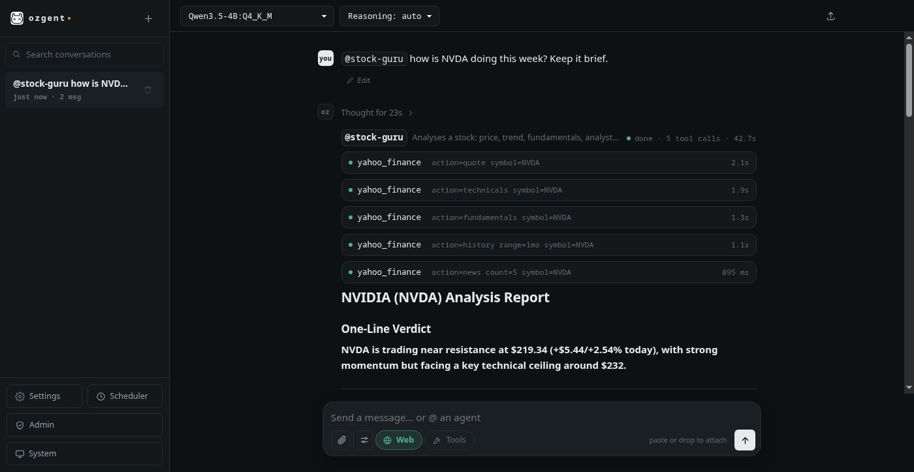
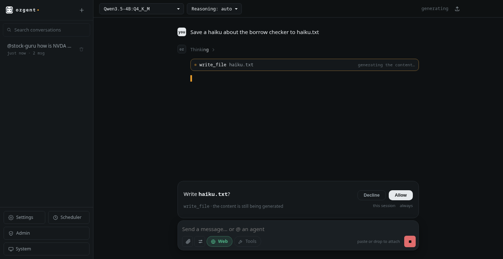
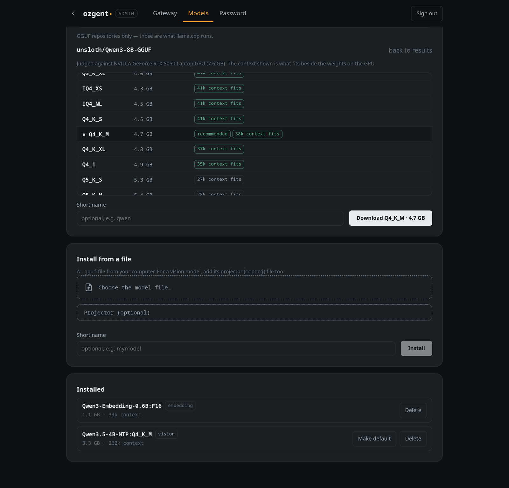
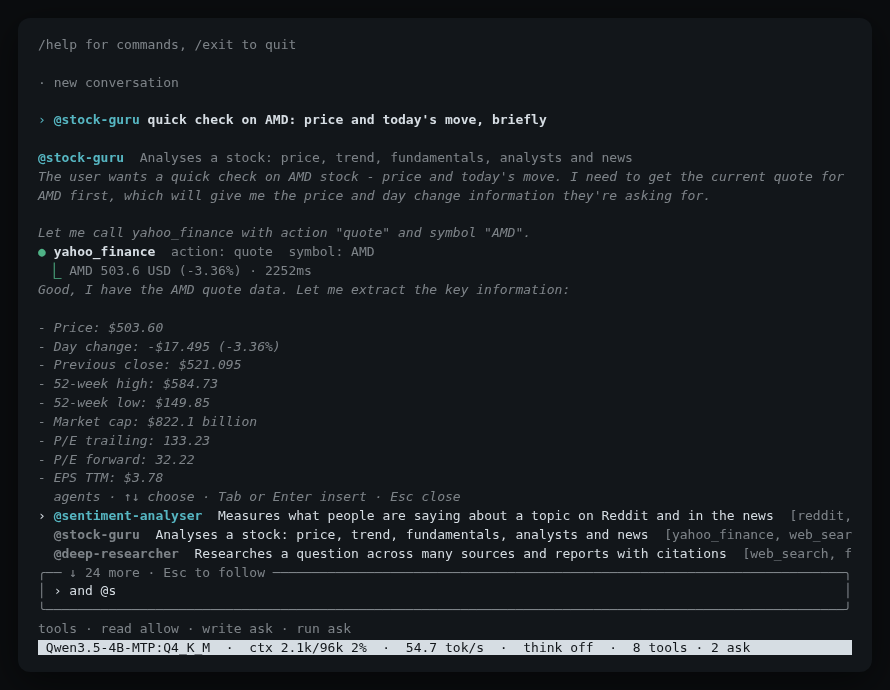
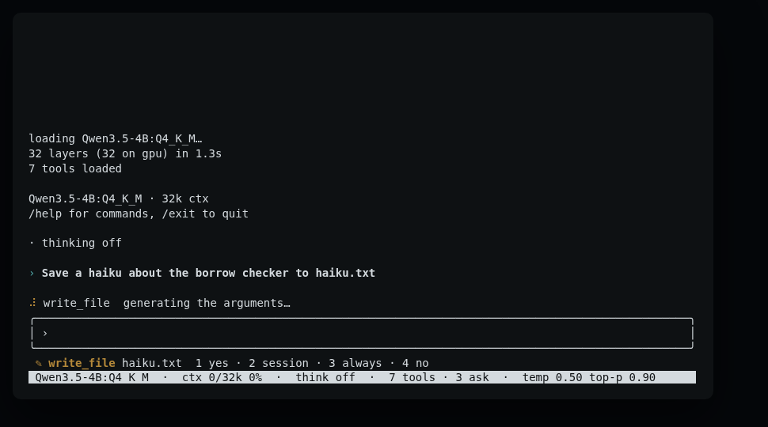
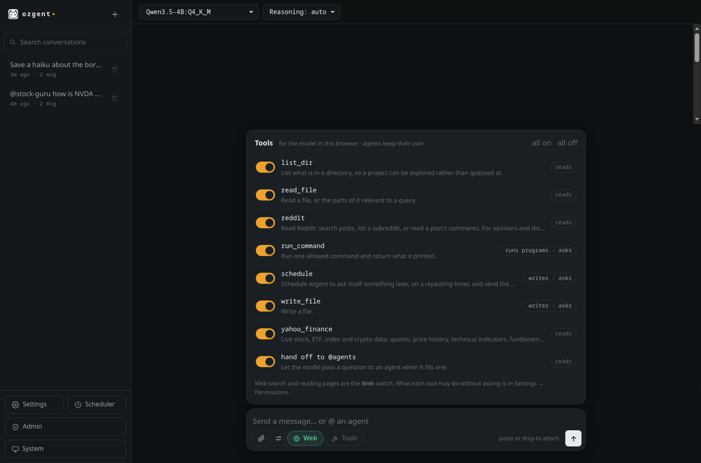
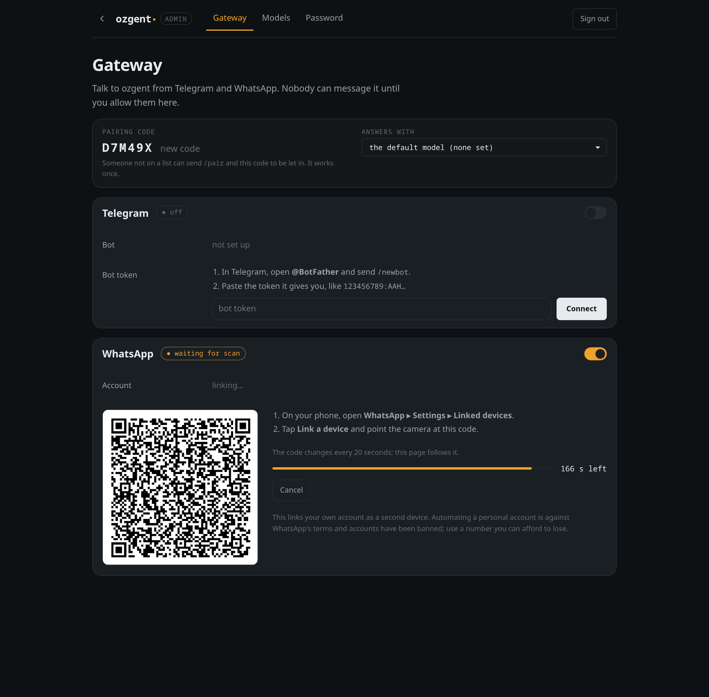
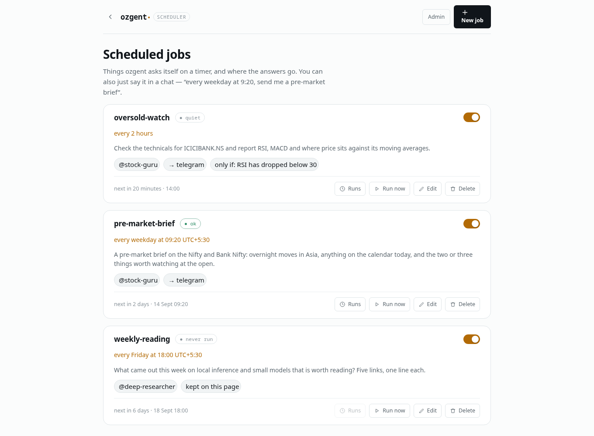

# ozgent

Run language models on your own machine — and let them actually *do* things.

ozgent is one Rust binary over llama.cpp. It gives you a terminal app, a web
interface, an OpenAI- and Anthropic-compatible API, tools that really run,
`@agents` that use them, a scheduler for the things you want without asking,
and a permission prompt before anything touches your disk.



```bash
ozgent                    # chat in the terminal
ozgent daemon install     # run it in the background: jobs, channels, web, API
ozgent web                # chat in a browser — and answer Telegram and WhatsApp
ozgent gateway telegram   # set up a chat app by answering a few questions
ozgent scheduler add      # something on a timer, with the answer sent to you
ozgent serve              # the API on its own, on :7337
```

---

## Why not Ollama or LM Studio?

They run models. ozgent runs models **and does the work around them**.

|  | ozgent | Ollama | LM Studio |
|---|---|---|---|
| Runs tools for you | built in — search, fetch, files, shell, markets, Reddit | you write the client | you wire it up |
| Agents you call with `@name` | yes, with their own tools — or the model hands over itself | — | — |
| **Asks before writing or running** | yes, before the content is even generated | — | — |
| MCP servers | yes | — | yes |
| Full-screen terminal UI | yes | plain prompt | — |
| Web interface | built in | desktop app | desktop app |
| OpenAI-compatible API | yes, and Anthropic-compatible | yes | yes |
| Chat from your phone | Telegram, WhatsApp | — | — |
| Remembers across chats | facts + retrieval | — | — |
| Context sized to your VRAM | worked out for you, and reported | set by hand | set by hand |
| "Will it fit?" before downloading | context per size, from the file's header | — | size only |
| Licence | MIT | MIT | closed source |

*Both projects move fast; check their docs if a row matters to you.*

The one that matters most in practice: **ozgent asks before it acts.** A model
that wants to write a file or run a command stops and shows you what it is
about to do — *before* it spends a minute generating the file contents.



---

## Install

```bash
git clone https://github.com/0znio/ozgent
cd ozgent
./install.sh
```

That works out your distribution, installs what the build needs, picks a GPU
backend, compiles, and installs to `/usr/local` — `sudo` asks for your
password for that last step only. It is safe to re-run, and re-running is how
you update.

Use `./install.sh --dry-run` first if you want to see what it would do.

| | |
|---|---|
| `--backend cuda\|vulkan\|metal\|cpu` | override the detection |
| `--prefix ~/.local` | install somewhere you own instead (no sudo) |
| `--skip-deps` | don't install system packages |
| `--uninstall` | remove it again |

Debian, Ubuntu, Arch, Fedora, openSUSE, Alpine and macOS are handled; anything
else needs `--skip-deps` and a C++ compiler, CMake, git and Python 3.

<details>
<summary>Or build it yourself</summary>

Needs [Rust](https://rustup.rs) 1.85+, a C++ compiler and CMake.

```bash
cargo build --release --features cuda   # or vulkan, metal, or nothing for CPU
```

The binary is `target/release/ozgent`.
</details>

### On another machine

`./scripts/package.sh` builds a tarball with the binary, the Python tools and
an installer — nothing is compiled on the target. See
[docs/install.md](docs/install.md).

### First run

In the browser: `ozgent admin setup` once to choose a password, then
`ozgent web` and open **Admin → Models**. Search Hugging Face and pick a size —
before downloading anything it reads each file's header and tells you how much
context that size leaves room for on *your* GPU. Or install a `.gguf` you
already have. Downloads keep going if you close the tab.



Or from the terminal:

```bash
ozgent pull unsloth/Qwen3.5-4B-GGUF:Q4_K_M   # any GGUF repo, fetched in parallel
ozgent list                                  # what you have
ozgent default Qwen3.5-4B:Q4_K_M             # use it when none is named
ozgent                                       # chat
```

`ozgent pull <repo> --list` shows a repo's quantisations, and the context each
leaves room for on this GPU, without downloading.
`ozgent doctor` reports your GPU, backends and anything misconfigured.

---

## What you get

### A terminal app, not a prompt

Full screen, reflows on resize, markdown and syntax highlighting, and a status
bar showing the model, context used, and tokens/sec.



- **Shift+Enter** for a new line (Alt+Enter where the terminal can't report Shift).
- **Drag over text** to select it — it's copied when you let go. `/copy` copies
  the whole last reply.
- **Type `@`** for the agents; Tab or Enter picks one.
- Loading a model shows a progress bar, not a frozen line.

### Tools that run, with a prompt first

The model decides; you approve.

| tool | does | needs |
|---|---|---|
| `web_search` | searches the web or the news | a Brave or Tavily key, or none for DuckDuckGo |
| `fetch_url` | reads a page — the article, not the menus | — |
| `yahoo_finance` | quotes, price history, technicals (RSI, MACD, averages, support/resistance), fundamentals, news | — |
| `reddit` | searches posts, reads threads | optional app key for full speed |
| `read_file` · `list_dir` | read your files | — |
| `write_file` | writes a file | asks first |
| `run_command` | runs one program | asks first |

```
✎ write_file  haiku.txt   1 yes · 2 session · 3 always · 4 no
```



Reads run without asking. Writes and commands ask. Answer *always* once and it
becomes a rule you can edit later.

In the browser, **Web** beside the message box switches searching on and off,
and **Tools** opens a switch per tool.



Adding your own is a Python file in `~/ozgent/tools`:

```python
from typing import Annotated
from ozgent_tools import tool

@tool(effect="read")
async def define(word: Annotated[str, "The word to look up."]) -> dict:
    """Look up what a word means."""
    return {"word": word, "meaning": "a small furry animal"}
```

The signature becomes the schema the model is shown — there is no manifest to
keep in sync.

→ [docs/tools.md](docs/tools.md)

### Agents

Write `@name` and the message goes to an agent: its own instructions and
**only its own tools**. Its reply comes back like any other, headed with its
name, so you can see who did the work.

| agent | for | uses |
|---|---|---|
| `@deep-researcher` | a question answered from many sources, cited | `web_search`, `fetch_url` |
| `@stock-guru` | a stock: price, trend, fundamentals, news | `yahoo_finance`, `web_search`, `fetch_url` |
| `@sentiment-analyser` | what people think, from Reddit and the news | `reddit`, `web_search`, `yahoo_finance`, `fetch_url` |

```
@stock-guru how is NVDA doing after earnings?
@stock-guru @sentiment-analyser AMD — the numbers, then the mood
```

Or don't name one: when a request is squarely an agent's job — "how is NVDA
doing?" — the model hands it over itself, with the same `@name` label.

Type `@` for the list. Make your own in **Settings → Agents** or with
`ozgent agent new <name>`; they work over the API and on Telegram and WhatsApp
too. → [docs/agents.md](docs/agents.md)

### MCP servers

Point ozgent at any Model Context Protocol server and its tools join the list.

```toml
[mcp]
enabled = true

[mcp.servers.files]
command = "npx"
args    = ["-y", "@modelcontextprotocol/server-filesystem", "~/notes"]
```

Every MCP tool asks before running, because a server's own "this is read-only"
claim is written by the thing that wants to be run.
→ [docs/mcp.md](docs/mcp.md)

### Chat from your phone

Telegram (a bot) or WhatsApp (your own account, linked like WhatsApp Web).
Setting one up is answering a few questions — nothing to edit by hand:

```bash
ozgent gateway telegram   # paste the token from @BotFather, send the bot a code, done
ozgent gateway whatsapp   # scan a QR, say which numbers may message it
```

Nobody can talk to it until you allow them, and you choose which tools a chat
may use and whether tool calls can be approved from the phone. Run the same
command again to change anything — who is allowed, tools, the token, signing
out — or do it all on **/admin**, where WhatsApp's QR code appears on the page.
`ozgent web` answers the chats while it runs, and applies changes without a
restart.



→ [docs/channels.md](docs/channels.md)

### It runs in the background

```bash
ozgent daemon install    # systemd, OpenRC, runit, s6, dinit or launchd
```

One process owns the model, the database, the channels and the scheduler, and
serves the web interface and the API over all of it. Everything else becomes a
client of it: scheduled jobs run whether or not anything is open, Telegram is
answered without a terminal left running, and nothing loads a second copy of
the model.

It holds **no model at all** until something asks it a question, and drops it
again after fifteen idle minutes — a 4B model at Q4 is around 3 GB, and holding
it overnight for one morning brief is 3 GB of nothing. Freed memory is returned
to the kernel rather than parked in the allocator, and the scheduler sleeps
until the next job is due instead of ticking.

→ [docs/daemon.md](docs/daemon.md)

### Things on a timer

> every weekday at 9:20, send me a pre-market brief on Telegram

Say that in any chat — terminal, browser, phone — and ozgent schedules it. The
reply carries a **Job scheduled** pill, and the job is then on `/scheduler`,
where you can retime it, pause it, run it now, or read what last Thursday's
answer actually said.

```bash
ozgent scheduler                       what is scheduled
ozgent scheduler add                   set one up, question by question
ozgent scheduler when "every weekday at 9:20"   what that actually means
```

A job can carry a condition — *only if the price moved more than 2%* — so it
runs on its timer, is recorded every time, and only speaks when there is
something to say. That is the difference between a brief you read and a
notification you learn to swipe away.

A scheduled run happens with nobody watching, so it can never approve a tool
call: tools that run outright still run, anything that would ask is refused,
and the refusal is part of what arrives.



→ [docs/scheduler.md](docs/scheduler.md)

### An admin page, behind a password

`/admin` holds what should not be one click away from anyone on your network:
the gateway and model downloads.

```bash
ozgent admin setup    # choose the password (only an Argon2id hash is stored)
ozgent admin reset    # forgot it: a new one, every browser signed out
```

Wrong guesses are slowed and then locked out; `ozgent admin reset` on the
machine is always the way back in.

### It remembers

Conversations live in SQLite and are shared by every surface — start in the
terminal, continue in the browser, pick it up on your phone. Facts worth
keeping are retrieved into later chats.

**Search** goes across every conversation, not just the one you are in — the
question is always "where did I talk about the deploy script", and nobody
remembers which thread it was. **Retry** regenerates a reply, **Edit** puts one
of your messages back in the composer, and either way everything after it is
dropped, including facts learned from it. Any conversation downloads as
Markdown, because a local-first program should never be the only thing that can
read your own data.

### An OpenAI- and Anthropic-compatible API

```bash
ozgent serve
curl http://127.0.0.1:7337/v1/chat/completions \
  -d '{"model":"Qwen3-4B:Q4_K_M","messages":[{"role":"user","content":"hi"}]}'
curl http://127.0.0.1:7337/v1/messages \
  -d '{"model":"Qwen3-4B:Q4_K_M","max_tokens":512,"messages":[{"role":"user","content":"hi"}]}'
```

Point any OpenAI or Anthropic client at `http://127.0.0.1:7337/v1`. Streaming,
tool calls, reasoning and embeddings all work, and so do agents — `@name` in a
message, or picked as the model. `ozgent web` serves the same API on its own
port, over the model it already has loaded.
→ [docs/api.md](docs/api.md)

### Context sized to your hardware

Every model opens with 32k of context unless you say otherwise. Ask for a 1m
context on an 8 GB card and ozgent works out what actually fits, uses it, and
tells you — instead of failing with a null pointer.

Three inference modes: `gpu` (fastest, smallest context), `gpu_ram` (bigger
context, slower), `ram` (no GPU at all).

```bash
ozgent web --inference-mode gpu_ram
```

→ [docs/settings.md](docs/settings.md)

---

## Docs

| | |
|---|---|
| [settings.md](docs/settings.md) | every option, and where to set it |
| [tools.md](docs/tools.md) | the built-in tools and the permission rules |
| [agents.md](docs/agents.md) | `@agents`: the built-in ones and making your own |
| [mcp.md](docs/mcp.md) | connecting MCP servers |
| [channels.md](docs/channels.md) | Telegram and WhatsApp, and the admin page |
| [scheduler.md](docs/scheduler.md) | jobs on a timer, and where the answers go |
| [daemon.md](docs/daemon.md) | running ozgent in the background |
| [api.md](docs/api.md) | the HTTP API, endpoint by endpoint |
| [install.md](docs/install.md) | deploying to another machine |

---

## Status

Early. It works, it is tested, and the interfaces still move.

`ozgent web` binds `0.0.0.0` by default so a phone on the same wifi can reach
it. The chat itself **has no password** — only `/admin` does — so use
`--host 127.0.0.1` on a network you don't trust.

MIT licensed. `vendor/` carries patched copies of llama.cpp and its Rust
bindings, under their own licences — see [vendor/README.md](vendor/README.md).
