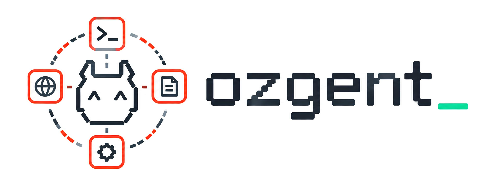
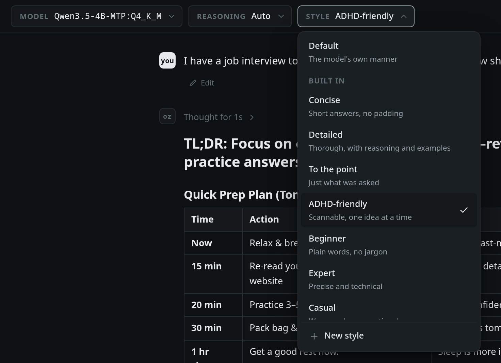
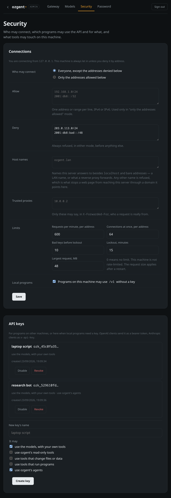

<p align="center"></p>

Run language models on your own machine — and let them actually *do* things.

ozgent is one Rust binary over llama.cpp. It gives you a terminal app, a web
interface, an OpenAI- and Anthropic-compatible API, tools that really run,
`@agents` that use them, a scheduler for the things you want without asking,
and a permission prompt before anything touches your disk.


```bash
ozgent                    # chat in the terminal
ozgent daemon install     # run it in the background: jobs, channels, web, API
ozgent web                # chat in a browser — and answer Telegram and WhatsApp
ozgent gateway telegram   # set up a chat app by answering a few questions
ozgent scheduler add      # something on a timer, with the answer sent to you
ozgent serve              # the API on its own, on :7337
```

---

## Why not Ollama or LM Studio?

They run models. ozgent runs models **and does the work around them**.

|  | ozgent | Ollama | LM Studio |
|---|---|---|---|
| Runs tools for you | built in — search, fetch, files, shell, markets, Reddit | you write the client | you wire it up |
| Agents you call with `@name` | yes, with their own tools — or the model hands over itself | — | — |
| **Asks before writing or running** | yes, before the content is even generated | — | — |
| MCP servers | yes — installed from the MCP Registry, and sandboxed | — | yes |
| Full-screen terminal UI | yes | plain prompt | — |
| Web interface | built in | desktop app | desktop app |
| OpenAI-compatible API | yes, and Anthropic-compatible | yes | yes |
| Chat from your phone | Telegram, WhatsApp | — | — |
| Remembers across chats | facts + retrieval by meaning, with a real embedding model | — | — |
| Response styles and personas per model | concise, detailed, ADHD-friendly… and your own | system prompt in a Modelfile | per chat |
| Commands the model runs are sandboxed | yes — no network, no credentials, only the folder you choose | — | — |
| API keys with scopes, IP allow/deny lists, rate limits | built in, set on the admin page | — | — |
| Context sized to your VRAM | worked out for you, and reported | set by hand | set by hand |
| Sliding-window models (Spark-X2.5, Gemma-style) | small window cache, 60% less memory, +48% with several chats | llama.cpp default | llama.cpp default |
| "Will it fit?" before downloading | context per size, from the file's header | — | size only |
| Licence | MIT | MIT | closed source |

*Both projects move fast; check their docs if a row matters to you.*

The one that matters most in practice: **ozgent asks before it acts.** A model
that wants to write a file or run a command stops and shows you what it is
about to do — *before* it spends a minute generating the file contents.


---

## Install

```bash
git clone https://github.com/0znio/ozgent
cd ozgent
./install.sh
```

That works out your distribution, installs what the build needs, picks a GPU
backend, compiles, and installs to `/usr/local` — `sudo` asks for your
password for that last step only. It is safe to re-run, and re-running is how
you update.

Use `./install.sh --dry-run` first if you want to see what it would do.

| | |
|---|---|
| `--backend cuda\|vulkan\|metal\|cpu` | override the detection |
| `--prefix ~/.local` | install somewhere you own instead (no sudo) |
| `--skip-deps` | don't install system packages |
| `--uninstall` | remove it again |

Debian, Ubuntu, Arch, Fedora, openSUSE, Alpine and macOS are handled; anything
else needs `--skip-deps` and a C++ compiler, CMake, git and Python 3.

<details>
<summary>Or build it yourself</summary>

Needs [Rust](https://rustup.rs) 1.85+, a C++ compiler and CMake.

```bash
cargo build --release --features cuda   # or vulkan, metal, or nothing for CPU
```

The binary is `target/release/ozgent`.
</details>

### On another machine

`./scripts/package.sh` builds a tarball with the binary, the Python tools and
an installer — nothing is compiled on the target. See
[docs/install.md](docs/install.md).

### First run

In the browser: `ozgent admin setup` once to choose a password, then
`ozgent web` and open **Admin → Models**. Search Hugging Face and pick a size —
before downloading anything it reads each file's header and tells you how much
context that size leaves room for on *your* GPU. Or install a `.gguf` you
already have. Downloads keep going if you close the tab.


Or from the terminal:

```bash
ozgent pull unsloth/Qwen3.5-4B-GGUF:Q4_K_M   # any GGUF repo, fetched in parallel
ozgent list                                  # what you have
ozgent default Qwen3.5-4B:Q4_K_M             # use it when none is named
ozgent                                       # chat
```

`ozgent pull <repo> --list` shows a repo's quantisations, and the context each
leaves room for on this GPU, without downloading.
`ozgent doctor` reports your GPU, backends and anything misconfigured.

---

## What you get

### A terminal app, not a prompt

Full screen, reflows on resize, markdown and syntax highlighting, and a status
bar showing the model, context used, and tokens/sec.


It loads nothing itself: it asks the daemon, so a model already resident
answers straight away and no second copy goes into VRAM.

- **Shift+Enter** for a new line (Alt+Enter where the terminal can't report Shift).
- **Drag over text** to select it — it's copied when you let go. `/copy` copies
  the whole last reply.
- **Type `@`** for the agents; Tab or Enter picks one.
- Loading a model shows a progress bar, not a frozen line — on the rare turn
  where one has to be loaded at all.

### Tools that run, with a prompt first

The model decides; you approve.

| tool | does | needs |
|---|---|---|
| `web_search` | searches the web or the news | a Brave or Tavily key, or none for DuckDuckGo |
| `fetch_url` | reads a page — the article, not the menus | — |
| `yahoo_finance` | quotes, price history, technicals (RSI, MACD, averages, support/resistance), fundamentals, news | — |
| `reddit` | searches posts, lists subreddits, reads threads | none — no account needed |
| `read_file` · `list_dir` | read your files | — |
| `write_file` | writes a file | asks first |
| `run_command` | runs one program | asks first |

```
✎ write_file  haiku.txt   1 yes · 2 session · 3 always · 4 no
```


Reads run without asking. Writes and commands ask. Answer *always* once and it
becomes a rule you can edit later.

In the browser, **Web** beside the message box switches searching on and off,
and **Tools** opens a switch per tool.


Adding your own is a Python file in `~/ozgent/tools`:

```python
from typing import Annotated
from ozgent_tools import tool

@tool(effect="read")
async def define(word: Annotated[str, "The word to look up."]) -> dict:
    """Look up what a word means."""
    return {"word": word, "meaning": "a small furry animal"}
```

The signature becomes the schema the model is shown — there is no manifest to
keep in sync.

→ [docs/tools.md](docs/tools.md)

### Agents

Write `@name` and the message goes to an agent: its own instructions and
**only its own tools**. Its reply comes back like any other, headed with its
name, so you can see who did the work.

| agent | for | uses |
|---|---|---|
| `@deep-researcher` | a question answered from many sources, cited | `web_search`, `fetch_url` |
| `@stock-guru` | a stock: price, trend, fundamentals, news | `yahoo_finance`, `web_search`, `fetch_url` |
| `@sentiment-analyser` | what people think, from Reddit and the news | `reddit`, `web_search`, `yahoo_finance`, `fetch_url` |

```
@stock-guru how is NVDA doing after earnings?
@stock-guru @sentiment-analyser AMD — the numbers, then the mood
```

Or don't name one: when a request is squarely an agent's job — "how is NVDA
doing?" — the model hands it over itself, with the same `@name` label.

Type `@` for the list. Make your own in **Settings → Agents** or with
`ozgent agent new <name>`; they work over the API and on Telegram and WhatsApp
too. → [docs/agents.md](docs/agents.md)

### MCP servers

Add any Model Context Protocol server and its tools join the list — in the
browser, the terminal, on your phone and over the API. Install one from the
official MCP Registry on the admin page (**Admin → MCP → Add a server**), or:

```bash
ozgent mcp search github
ozgent mcp install io.github.YawLabs/fetch-mcp
ozgent mcp add files --npm @modelcontextprotocol/server-filesystem -- ~/notes
```

A server you add runs in ozgent's sandbox: a home of its own, only the folders
you give it, none of your credentials, and ozgent's own keys stay out of its
environment. You see the exact command before anything is saved. Switch
servers and single tools on and off on the admin page, or `/mcp` in the
terminal.

Add as many as you like. Past about 4,000 tokens of descriptions, a server's
tools are no longer described up front: the model gets a directory of them,
and each message brings the few it is most likely about in full. Measured
with 2,792 tools from 308 servers, one short message took 5,143 tokens of
context.

Every MCP tool asks before running unless you allow it, because a server's own
"this is read-only" claim is written by the thing that wants to be run.
→ [docs/mcp.md](docs/mcp.md)

### Chat from your phone

Telegram (a bot) or WhatsApp (your own account, linked like WhatsApp Web).
Setting one up is answering a few questions — nothing to edit by hand:

```bash
ozgent gateway telegram   # paste the token from @BotFather, send the bot a code, done
ozgent gateway whatsapp   # scan a QR, say which numbers may message it
```

Nobody can talk to it until you allow them, and you choose which tools a chat
may use and whether tool calls can be approved from the phone. Run the same
command again to change anything — who is allowed, tools, the token, signing
out — or do it all on **/admin**, where WhatsApp's QR code appears on the page.
`ozgent web` answers the chats while it runs, and applies changes without a
restart.


→ [docs/channels.md](docs/channels.md)

### One model, however many things are using it

```bash
ozgent daemon install    # systemd, OpenRC, runit, s6, dinit or launchd
```

One process owns the model, the database, the channels and the scheduler, and
serves the web interface and the API over all of it. **Everything else is a
client** — the browser, the terminal, your phone. Open `ozgent chat` beside a
running daemon and it does not load anything:

```
$ ozgent chat Qwen3.5-4B
Qwen3.5-4B-MTP:Q4_K_M · asking the ozgent daemon
```

Measured: the terminal added 100 MB beside a daemon holding a 4B model, not a
second 3.9 GB copy. If nothing is listening, one is started and left running,
so the first question of the day pays for the model load and the rest do not.

Several models can be resident at once, bounded by the memory that is actually
free — read from the driver, so it counts other programs on the card too.
There is no maximum count, because every count is wrong for somebody: a 64 GB
card holding ten models is fine. When the next one does not fit, ozgent
offloads what does, and drops models nobody is using before it drops layers.

One model answers **several conversations at once**, sharing a forward pass
between them rather than queueing. Measured on a 4B model, four callers asking
together finished in 4.0s where they used to take 8.3s one after another — 101
tokens a second across them against 46 — and a single caller is unchanged. The
prefix every conversation starts with, your system prompt and tool schemas, is
held once and lent to each new conversation instead of being prefilled again:
on a 2,260-token preamble that is 2,269 prompt tokens down to 9, and a first
reply in 0.64s instead of 3.5s. Neither needs turning on.

It holds **no model at all** until something asks it a question, and drops it
again after fifteen idle minutes — a 4B model at Q4 is around 3 GB, and holding
it overnight for one morning brief is 3 GB of nothing. Freed memory is returned
to the kernel rather than parked in the allocator, and the scheduler sleeps
until the next job is due instead of ticking.

→ [docs/daemon.md](docs/daemon.md)

### Things on a timer

> every weekday at 9:20, send me a pre-market brief on Telegram

Say that in any chat — terminal, browser, phone — and ozgent schedules it. The
reply carries a **Job scheduled** pill, and the job is then on `/scheduler`,
where you can retime it, pause it, run it now, or read what last Thursday's
answer actually said.

```bash
ozgent scheduler                       what is scheduled
ozgent scheduler add                   set one up, question by question
ozgent scheduler when "every weekday at 9:20"   what that actually means
```

A job can carry a condition — *only if the price moved more than 2%* — so it
runs on its timer, is recorded every time, and only speaks when there is
something to say. That is the difference between a brief you read and a
notification you learn to swipe away.

A scheduled run happens with nobody watching, so it can never approve a tool
call: tools that run outright still run, anything that would ask is refused,
and the refusal is part of what arrives.


→ [docs/scheduler.md](docs/scheduler.md)

### Answers the way you want them

Every model can have a **persona** — standing instructions you write, like
"you are my Rust reviewer; point to the line and suggest the fix" — and a
**response style**:

| style | what it does |
|---|---|
| `concise` | the answer, in the few sentences it needs |
| `detailed` | reasoning, edge cases and an example |
| `to-the-point` | only what was asked, one line when one line will do |
| `adhd` | a one-line answer first, then short bullets, key words in bold, small numbered steps |
| `beginner` · `expert` · `casual` · `formal` · `tutor` | what they say |



Make your own with **New style** in the web page's Style menu. In the terminal:

```
/style                  what is set, and every style there is
/style adhd             use one for this model
/style new pirate Answer like a cheerful pirate captain, and stay correct.
/persona You review Rust. Be direct.
/effort high            how long a thinking model may reason
```

They apply to your chats — web, terminal, Telegram, WhatsApp — and never to
an API caller's request, which brings its own system prompt.

### An admin page, behind a password

`/admin` holds what should not be one click away from anyone on your network:
the gateway, model downloads, the embedding model, who may connect, API keys,
and what tools may touch.

```bash
ozgent admin setup    # choose the password (only an Argon2id hash is stored)
ozgent admin reset    # forgot it: a new one, every browser signed out
```

Wrong guesses are slowed and then locked out; `ozgent admin reset` on the
machine is always the way back in.

### Locked down by default

The web page, its API and `/v1` share one port, and every request through it
is checked in the same order:

- **Who may connect at all** — an allow list or a deny list of IPv4 and IPv6
  addresses and ranges, refused before a byte of HTTP is read. Connections per
  address are capped, and one that stalls is closed.
- **How often** — requests per minute per address, and a lockout after
  repeated bad keys.
- **Which name it was asked by** — a web page that points its own domain at
  your machine is refused (DNS rebinding), and a write from another site is
  refused too.
- **Who is asking** — the page on this machine carries a token only it can
  read; another machine signs in with the admin password; a program presents
  an **API key**, created on the admin page with the scopes it needs: the
  models, ozgent's read-only tools, tools that write or run, agents.

All of it is on the admin page under **Security**:



The model's own actions are fenced as well. A command it runs goes into a
**sandbox** — no network unless you allow it, nothing written outside the
folder you chose, ozgent's own files and your SSH, cloud and browser
credentials out of reach, other processes hidden where the system allows
it, and everything it started gone when it times out. A page it fetches can't send it to this
machine, your router or a cloud metadata address. Settings that would change
which program runs are set on the admin page or in the file, never through
the chat page's API.

### It remembers

Conversations live in SQLite and are shared by every surface — start in the
terminal, continue in the browser, pick it up on your phone. Facts worth
keeping are retrieved into later chats.

Recall works by **meaning**, not only by words, once an embedding model is
installed — ozgent uses the one you have without being told (Qwen3-Embedding
is a good choice). "What did we do about the slow API?" finds the message
that said "added a connection pool". Earlier messages are embedded in the
background, long ones whole up to the model's own window, and the question is
only embedded when there is something older to search, so a short chat pays
nothing.

**Search** goes across every conversation, not just the one you are in — the
question is always "where did I talk about the deploy script", and nobody
remembers which thread it was. **Retry** regenerates a reply, **Edit** puts one
of your messages back in the composer, and either way everything after it is
dropped, including facts learned from it. Each reply keeps the speed it was
written at and how long the model thought before it, so a reloaded
conversation still shows both. Any conversation downloads as
Markdown, because a local-first program should never be the only thing that can
read your own data.

### An OpenAI- and Anthropic-compatible API

```bash
ozgent serve
curl http://127.0.0.1:7337/v1/chat/completions \
  -d '{"model":"Qwen3-4B:Q4_K_M","messages":[{"role":"user","content":"hi"}]}'
curl http://127.0.0.1:7337/v1/messages \
  -d '{"model":"Qwen3-4B:Q4_K_M","max_tokens":512,"messages":[{"role":"user","content":"hi"}]}'
```

Point any OpenAI or Anthropic client at `http://127.0.0.1:7337/v1`. Streaming,
tool calls, reasoning and embeddings (float or base64, with `dimensions`) all
work, and so do agents — `@name` in a message, or picked as the model.
`ozgent web` serves the same API on its own port, over the model it already
has loaded.

Programs on this machine need no key. From anywhere else, create one on the
admin page and send it the way your client already does — `Authorization:
Bearer ozk_…` for OpenAI clients, `x-api-key: ozk_…` for Anthropic ones. A key
can use the models with your own tools, ozgent's tools, or agents, as you
choose when you make it.
→ [docs/api.md](docs/api.md)

### Models larger than your card

A mixture-of-experts model keeps most of its weight in routed experts that any
one token barely touches. `--cpu-moe` leaves those in system RAM and keeps
attention on the GPU:

```bash
ozgent chat big-moe --cpu-moe       # every routed expert on the host
ozgent chat big-moe --cpu-moe=16    # only the first 16 layers'
```

It trades a memory wall for a bandwidth cost — the model stops being bounded by
VRAM and starts being bounded by how fast your RAM reads. This is the setting
that makes a model *possible* rather than fast; if a smaller quantisation fits
on the card outright, that will be quicker. In the web interface it is
**Settings → CPU MoE layers**.

### Context sized to your hardware

Every model opens with 64k of context unless you say otherwise. Ask for a 1m
context on an 8 GB card and ozgent works out what actually fits, uses it, and
tells you — instead of failing with a null pointer.

Models whose layers mostly attend over a sliding window — Spark-X2.5 runs 27
of 36 layers on a 512-token window — keep only that window for those layers,
where llama.cpp's own default keeps the whole context for every one. On an 8 GB
card that is 1.1 GB of cache instead of 2.8 at 32k, and four conversations at
once 48% faster.

Three inference modes: `gpu` (fastest, smallest context), `gpu_ram` (bigger
context, slower), `ram` (no GPU at all).

```bash
ozgent web --inference-mode gpu_ram
```

→ [docs/settings.md](docs/settings.md)

---

## Docs

| | |
|---|---|
| [settings.md](docs/settings.md) | every option, and where to set it |
| [tools.md](docs/tools.md) | the built-in tools and the permission rules |
| [agents.md](docs/agents.md) | `@agents`: the built-in ones and making your own |
| [mcp.md](docs/mcp.md) | connecting MCP servers |
| [channels.md](docs/channels.md) | Telegram and WhatsApp, and the admin page |
| [scheduler.md](docs/scheduler.md) | jobs on a timer, and where the answers go |
| [daemon.md](docs/daemon.md) | running ozgent in the background |
| [api.md](docs/api.md) | the HTTP API, endpoint by endpoint |
| [install.md](docs/install.md) | deploying to another machine |
| [technical.md](docs/technical.md) | how inference works: placement, KV cache, batching, caching, threads |

---

## Status

Early. It works, it is tested, and the interfaces still move.

`ozgent web` binds `0.0.0.0` by default so a phone on the same wifi can reach
it. Other machines sign in with the admin password and programs need an API
key, and who may connect at all is set on the admin page under **Security**.
`--host 127.0.0.1` keeps it to this machine altogether.

MIT licensed. `vendor/` carries patched copies of llama.cpp and its Rust
bindings, under their own licences — see [vendor/README.md](vendor/README.md).
