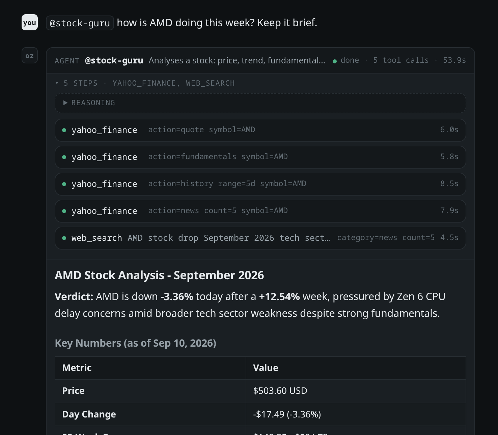

# Agents

An agent is a named job: its own instructions, its own tools, its own rules.
Write `@name` in a message and that message goes to the agent instead of the
plain model.

```
@stock-guru how is NVDA doing after earnings?
```

Type `@` in the terminal or the browser and a panel lists the agents; **↑↓**
to choose, **Tab** or **Enter** to insert.



## What you get

The agent's work shows **where it ran** in the conversation: a framed block
with its name, every step it took, and its report. The steps fold away once it
answers.

| agent | for | tools |
|---|---|---|
| `@deep-researcher` | a question answered from many sources, with citations | `web_search`, `fetch_url` |
| `@stock-guru` | a stock, ETF, index or coin: price, trend, fundamentals, news | `yahoo_finance`, `web_search`, `fetch_url` |
| `@sentiment-analyser` | how people feel about something, from Reddit and the news | `reddit`, `web_search`, `yahoo_finance`, `fetch_url` |

Several in one message run in turn, each seeing the reports before it (up to
three):

```
@stock-guru @sentiment-analyser NVDA — numbers, then the mood
```

## The rules

- **It sees only its own tools.** The rest are never shown to the model, and a
  call to one anyway is refused. A research agent cannot be talked into
  writing a file.
- **Your `deny` always wins.** An agent can loosen `ask` to `allow` for its own
  tools, or tighten `allow` to `ask`, but a global `deny` stands.
- **It gets the conversation as context**, so `@stock-guru and that one?`
  works.
- **Its report is the reply**, stored like any other, so the next message can
  build on it.

Over the API the same `@name` works, and agents are listed as models — see
[api.md](api.md#agents-over-the-api). On Telegram and WhatsApp a mention works
too, within that chat's own tool list.

## Making your own

In the browser: **Settings → Agents → New agent**. From the terminal:

```bash
ozgent agent new news-digest              # a template, opened in $EDITOR
ozgent agent new my-guru --from stock-guru
ozgent agent edit stock-guru              # copies the built-in, you edit the copy
ozgent agent rm my-guru                   # removing an edited built-in restores it
ozgent agent list
```

An agent is one file, `~/ozgent/agents/<name>.toml`:

```toml
description = "Summarises today's news on a topic"   # shown in the @ panel
tools = ["web_search", "fetch_url"]                   # the only tools it gets
max_rounds = 8        # tool rounds before it must answer (1-32)
thinking = "auto"     # auto | on | off — leave out to follow the chat
temperature = 0.3     # leave out for the model's own

instructions = """
Find today's most important stories on the topic, read the three best, and
report five bullets, each with its source.
"""

[permissions]         # per tool: allow | ask | deny — leave out for your global rule
web_search = "allow"
fetch_url = "allow"
```

Names are lowercase letters, digits and hyphens. A file with a built-in's name
replaces it. Changes apply on the next message — there is nothing to restart.
In the terminal, `/agents` lists them and `/agents <name>` shows one.
