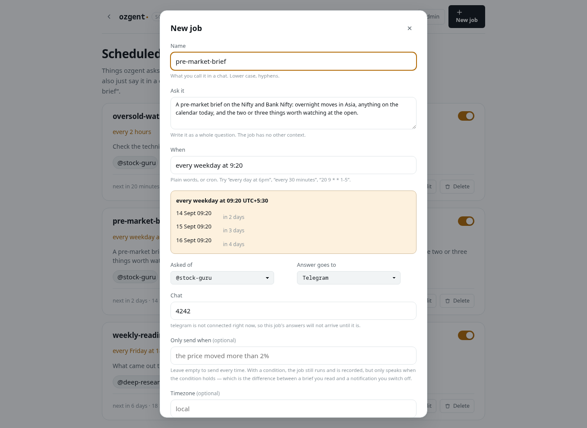

# Things ozgent does on a timer

A **job** is a question ozgent asks itself on a schedule, and somewhere the
answer goes. "Every weekday at 9:20, a pre-market brief, on Telegram." It runs
the same engine, the same agents, the same tools and the same memory as
everything else — a scheduled answer is a real conversation you can open in the
browser afterwards.

```
ozgent scheduler                  what is scheduled, and when each next runs
ozgent scheduler add              set one up, question by question
ozgent scheduler show <job>       its settings and how recent runs went
ozgent scheduler run <job>        run it now
ozgent scheduler pause <job>      stop it without losing it
```

Or just say it in a chat — terminal, browser or phone:

> every weekday at 9:20, send me a pre-market brief on the Nifty

and ozgent creates the job itself. The reply carries a **Job scheduled** pill
naming it, so you know something durable happened rather than that a message
was answered.


## Something has to be running

A job is a row in the database. It fires when a **scheduler** is awake to fire
it, and exactly one process runs them at a time — a lock file decides which, the
same way one decides which process answers Telegram. Two would deliver every
brief twice.

The scheduler runs inside `ozgent daemon` and inside `ozgent web`. The daemon is
the one to want:

```
ozgent daemon install
```

See [the daemon](daemon.md). Without one, `ozgent scheduler` says so at the
bottom of its listing, and `/scheduler` says so in a banner — because perfectly
good jobs and nothing awake to run them is the failure people stare at longest
without diagnosing.

**A fire that passed while nothing was running is not run late.** A 9:20
pre-market brief delivered at 3pm is worse than no brief. It is recorded as
*missed*, so the gap is visible rather than silently closed over.

## When

Times are wall-clock times where you are, not offsets from UTC — 9:20 is still
9:20 on the days either side of a daylight-saving change. Write them however you
like:

| | |
|---|---|
| `every weekday at 9:20` | Monday to Friday |
| `every day at 6pm` | `daily at 18:00` works too |
| `every monday, friday at 18:00` | named days |
| `every weekend at 10:00` | Saturday and Sunday |
| `every 30 minutes` | lands on :00 and :30, not 30 minutes after you typed it |
| `every 2 hours` | on the hour |
| `in 90 minutes` | once, then never again |
| `20 9 * * 1-5` | cron, if that is your dialect |

`ozgent scheduler when "every weekday at 9:20"` reads a rule back and prints the
next five times it fires. Worth doing once: `20 9 * * 1-5` and `9 20 * * 1-5`
are both valid and only one of them is nine twenty in the morning. The
`/scheduler` form does the same thing as you type:



Several times a day have to share a minute — `9:20` and `18:20` is one job,
`9:20` and `18:45` is two. A cron rule is a product, so the second pair would
also fire at 9:45 and 18:20, and firing four times when you asked for twice is
worse than being told to make two jobs.

## Timezones

**A time with no zone on it is your own clock.** `4pm` is 4pm where this
machine is — never UTC, and never converted behind your back. `ozgent
scheduler when` prints which zone it resolved, so you can check:

```
$ ozgent scheduler when "every day at 4pm"
every day at 16:00 UTC+5:30
  stored as   cron 0 16 * * *
  timezone    Asia/Kolkata
```

Name a zone and it is used instead — in the phrase itself, or with
`--timezone`:

```
$ ozgent scheduler when "every day at 4pm UTC"
every day at 16:00 UTC
  stored as   cron 0 16 * * *
  timezone    UTC
  your clock  Asia/Kolkata (UTC+5:30)

  2026-09-12 Sat  16:00  =  21:30 your time   in 8 hours
```

A job in another zone always shows both, because working out what "16:00 UTC"
is on your own clock is exactly the arithmetic this is here to save.

Three-letter abbreviations are **refused**, not guessed: `IST` is India,
Ireland and Israel, and there are three different `EST`s. Write the full IANA
name — `Asia/Kolkata`, `Europe/London` — or leave it out.

`local` is stored rather than resolved, so a laptop that crosses a border
keeps meaning "9:20 where I am". And a job keeps its wall-clock time across a
daylight-saving change: 9:20 is still 9:20 on the morning the clocks move.

## Where the answer goes

Three choices, and "nowhere" is a real one:

- **Telegram** or **WhatsApp** — it arrives unprompted, headed with the job's
  name so a block of text at 9:20 says what it is.
- **Nowhere** — it still runs, and the answer is on `/scheduler` and in the
  conversation. Right for a job you read when you get to it.

Every run is recorded either way, including the boring ones. A job that quietly
stopped working is the failure that matters: a brief that has not arrived for a
week looks exactly like a week with no news.

## Only tell me if

A job can carry a condition:

> every hour, check ICICIBANK — only if RSI drops below 30

The job runs on its timer and is recorded every time. It only *speaks* when the
condition holds. This is the difference between a brief you read and a
notification you learn to swipe away: a cron that always fires becomes noise
within a week, and a watch that rarely fires stays trusted.

Under the hood the run produces its answer and is then asked a second, separate
question — is the condition met, yes or no — with a grammar that admits only
those two words. Asking the brief to end in a verdict was the obvious
alternative and is not reliable; a small model writing prose forgets the format
often enough that a watch built on it would send every time.

If the verdict cannot be read at all, the answer is **sent**. The failure worth
avoiding is a watch that goes quiet and is trusted to be quiet for a good reason.

## A job cannot approve a tool call

This is the rule everything else follows from.

A scheduled run happens with nobody watching. There is no one to ask at 9:20 in
the morning, and a scheduler that answered "yes" on your behalf would be a way
to turn "read me the news" into `run_command` while you sleep.

So: **tools that run without asking still run. Anything that would ask is
refused** — and the refusal is appended to the answer, so a thin brief says why
it is thin instead of looking like a quiet news day.

If a job needs a tool that currently asks, the fix is to decide that in the
permission rules once, deliberately, in Settings — not to let a timer decide it.

## From a chat, and from the page

Both work, and the page can do more, on purpose. A chat is for the sentence you
are already in the middle of; the page is for reviewing fifteen jobs and finding
the one that has been failing since Tuesday.

From a chat you can create a job, retime it, pause, resume, delete, and list
them. Two things you cannot do:

- **Point a job at a different chat.** A job created from a chat answers back
  into that same chat. Otherwise "schedule me a reminder" becomes a way for
  someone allowed to message the bot to make ozgent message somebody else.
- **Widen its tools.** A job gets the tools that conversation had and no more,
  so a channel's allowlist cannot be escaped by scheduling around it.

Both are on `/scheduler`, where there is a person at this machine.

## Changing one later

```
ozgent scheduler set brief --when "every weekday at 8:00"
ozgent scheduler set brief --agent ""          # stop using an agent
ozgent scheduler set brief --only-if "the index moved more than 1%"
ozgent scheduler pause brief
ozgent scheduler rm brief
```

Or say it: *"move the morning brief to 8am"*. Or the page.

Changing the time moves the next run immediately rather than at the next tick —
a job rescheduled from 9:20 to 8:00 that still says 9:20 until tomorrow has not
really been rescheduled.

## When something is wrong

**Nothing has run.** Almost always nothing is awake to run it. `ozgent daemon
status` says whether the daemon is up, and whether it is the process holding the
scheduler lock.

**It ran but nothing arrived.** Open the job — `ozgent scheduler show <job>` or
the Runs button. A run marked *quiet* means its condition said there was nothing
worth sending; a run marked *ok* but not sent means the job delivers nowhere; a
*failed* run says why.

**A job failed five times in a row.** It is paused, deliberately. Something
failing on a timer forever buries the jobs that work. Fix it and resume it.

**A job stopped after one run.** `in 2 hours` and `once …` fire once by design.
`ozgent scheduler show` says `never — it is paused` for a job with nothing left
to do.

**The times look an hour out.** Check the timezone on the job. `ozgent scheduler
show <job>` prints it, and `ozgent scheduler when` prints real times in it.

## Settings

Jobs live in ozgent's database, not in `config.toml` — they are data, not
configuration, and two surfaces edit them concurrently. Nothing here needs
editing by hand.

The only related setting is how long a model is held after the last question:

```toml
[web]
idle_unload_minutes = 15   # 0 keeps it loaded
```

Which matters for a scheduler more than anything: a model kept for one 9:20
brief holds several gigabytes until midnight. See [the daemon](daemon.md).

See also [the daemon](daemon.md), [agents](agents.md), [channels](channels.md)
and [tools and permissions](tools.md).
